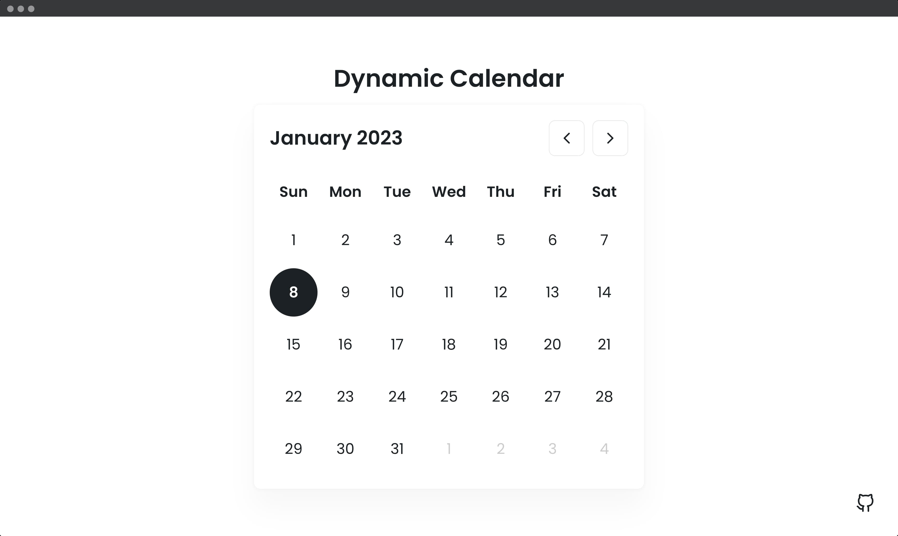

## 📦 Dynamic Calendar Component

In this calendar, you can see the current date and the day of the week. You can also see the past or future month days using the previous and next icons.

---

#### 🌄 Screenshots:

-----

#### 💻 Stack:

- [JavaScript](https://learn.javascript.ru/)
- [Sass](https://sass-lang.com/)

-----

#### 🙌 Author: [@nagoev-alim](https://github.com/nagoev-alim)
